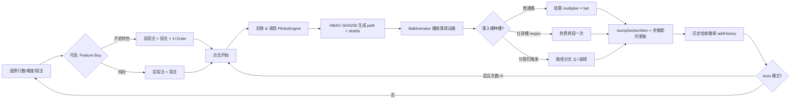
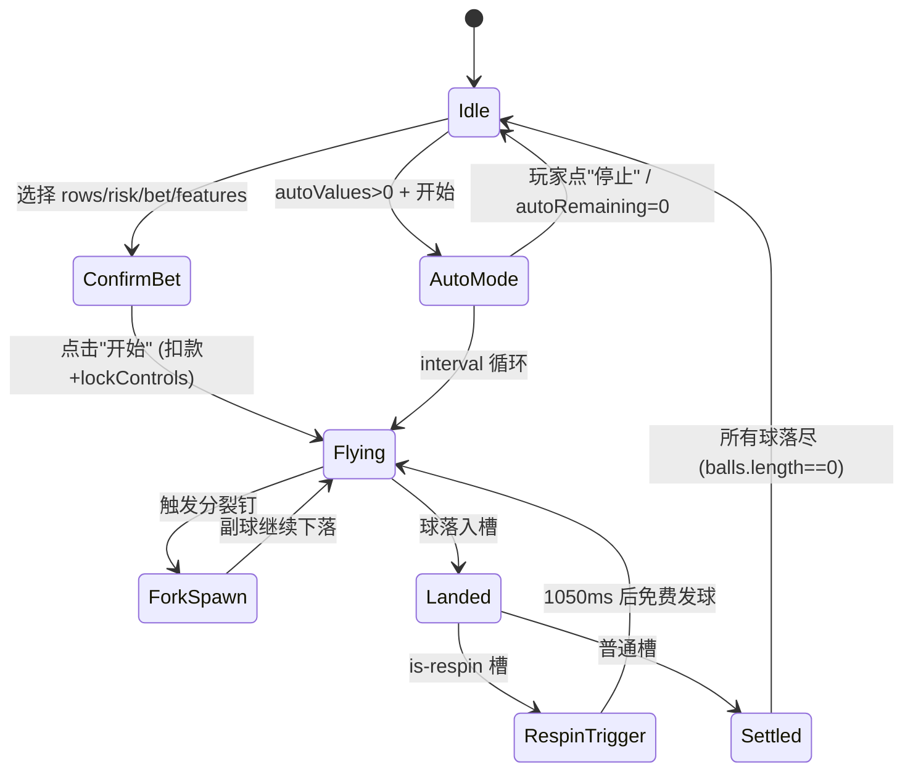
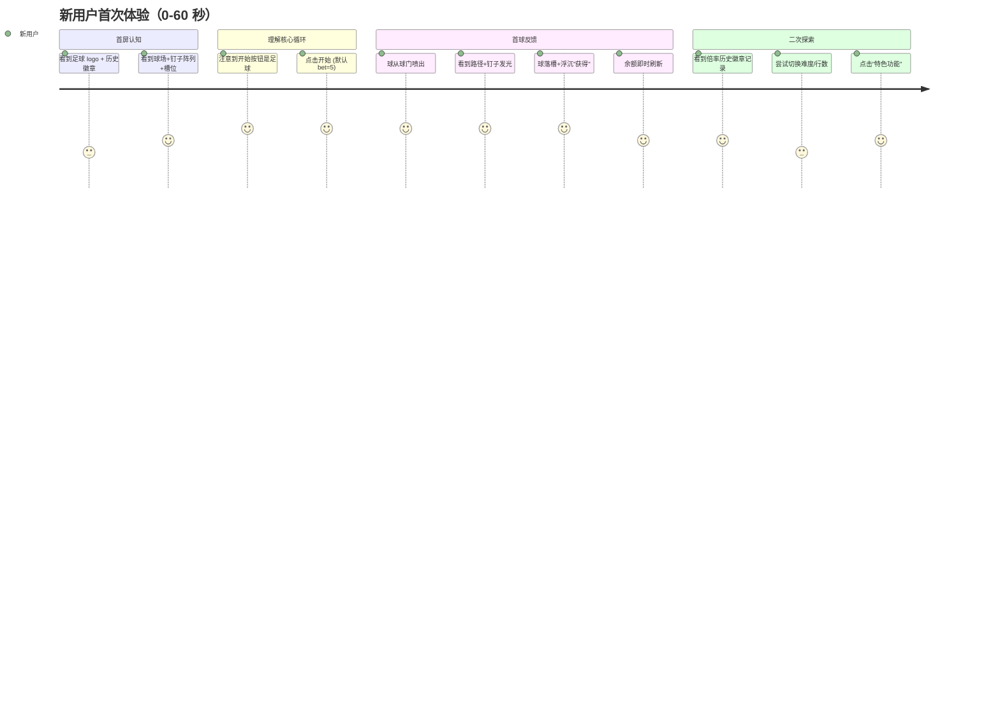

# GOLDEN GOAL · Lucky Drop — 产品需求文档（PRD）

> 足球主题 Plinko 小游戏 · 基于 Stake Provably Fair 算法的服务端权威架构

---

## 1. 文档信息

| 字段 | 内容 |
|---|---|
| 产品名称 | **GOLDEN GOAL**（内部代号：`lucky-drop`） |
| 文档版本 | PRD v1.0（基于代码仓库 **mockup v44 ~ v45** 逆向） |
| 文档日期 | 2026-04-25 |
| 目标平台 | Mobile-first H5（iPhone 14 逻辑分辨率 390 × 844） |
| 技术形态 | 单文件 HTML + CSS + Canvas + Web Crypto（5000+ 行 mockup） |
| 产品阶段 | UI/玩法/经济数学完成，服务端 API 未接入（前端已按接入就绪架构） |
| 作者 | 产品：-  / 设计：-  / 工程：- |

---

## 2. 产品概述

### 2.1 产品定位

面向**足球赛事流量**的 Casino-style 小游戏。把经典 Plinko 机制包装成"把足球从球门踢下，穿过场地钉子阵列，落入底部倍率槽"的观赛风味体验，目标是：

- 在大型赛事周期（世界杯 / 欧冠 / 联赛决赛）蹭体育情绪势能；
- 把**博彩机制（Plinko）**伪装成**体育小游戏（射门、反弹、进球）**，降低首次认知门槛；
- 对标 Stake Plinko 的数学期望与操作手感，但用体育化叙事和 IP 资产差异化。

### 2.2 目标用户画像

| 画像 | 特征 | 核心诉求 |
|---|---|---|
| **P1 · 体育游戏玩家** | 赛事流量引入；不熟悉传统 Casino | 简单易懂、视觉冲击、快速爆分反馈 |
| **P2 · 老 Plinko 玩家** | 熟悉 Stake Plinko、敏感 RTP/难度 | 公平性可验证、Auto 投注、高难度槽位 |
| **P3 · 中度氪金玩家** | 追求"特色功能爆分" | 想要可购买的高波动玩法（裂变 / 高倍率球） |

### 2.3 核心价值主张

> **"一脚踢出去，看你的球能把多少奖金带回来。"**

- **简单**：一个按钮（开始）、一颗球、一条随机下落路径；
- **公平**：Stake 风格 Provably Fair（HMAC-SHA256 + serverSeedHash 提前公开）；
- **可控**：9 档行数 × 3 档难度 × 3 项可选特色功能 = **81 种数学配置**；
- **有爆点**：16 行疯狂模式顶槽 **2500×**（最大押注 1000 时理论最高 250 万返还）。

### 2.4 竞品对标

| 维度 | Stake Plinko（标杆） | GOLDEN GOAL（本产品） |
|---|---|---|
| 最大倍率 | 1000× (16 行 High) | **2500×** (16 行疯狂) |
| RTP | ≈ 99% | **97.5%（基础）/ 98%（特色功能开启）** |
| 主题 | 抽象球 + 金属钉 | **足球 + 日光体育场 + 球门** |
| 特色机制 | 无 | **三项可叠加 Feature Buy**（分裂 / 免费球 / 高倍率球） |
| 可验证性 | HMAC-SHA256 | 同（完全对齐 Stake 算法） |

---

## 3. 核心玩法

### 3.1 玩法总览

玩家从顶部球门发一颗足球，球经过 **R 行钉子**（R ∈ [8, 16]）的随机左右碰撞后落入底部 **R+1 个倍率槽**，按"投注额 × 倍率"结算。路径由服务端 HMAC-SHA256 预先算出，前端 Canvas 只负责可视化。

### 3.2 核心循环图



### 3.3 单局流程（时序）

```
t=0ms    用户点击"开始"
         └─> 扣除 totalCost = bet × (1 + Σfeature_rate)
         └─> lockControls(true)
         └─> 调用 PlinkoEngine.placeBet({ rows, modeIdx })
              └─> HMAC-SHA256(serverSeed, `${clientSeed}:${nonce}:${cursor}`)
              └─> 返回 { path[R], slotIdx, multiplier, seed }

t≈50ms   球从 domeBase（球门）喷出，initY = padT-30, initVy = 1.8
         BallAnimator 按预算 path[] 驱动球逐行下落

t≈R×180ms 每行触发一次 pegHit 事件（钉子泛光 + SFX）
          若命中分裂钉 → spawnForkBall（副球 HMAC：...:fork:{r}:{c}:...）

t≈3s     球落入 slotIdx 对应槽，触发 settle：
          ├─ winning 动画（槽位脉冲 + 冲击光）
          ├─ bumpSectionWon(won) 浮沉"获得"胶囊
          ├─ balance += won 即时刷新
          ├─ addHistory(multiplier) 顶部徽章
          └─ 若 is-respin 槽 → 1050ms 后 launchBall({ free: true })

t≈5.5s   所有球落尽 2.5s 后无新球 → sectionWon 归零淡出
         lockControls(false)
```

---

## 4. 游戏机制详解

### 4.1 钉子阵列（三角形 Pascal 结构）

```
                   ●            ← 第 0 行：1 钉（发球口正下）
                  ● ●           ← 第 1 行：2 钉
                 ● ● ●
                ● ● ● ●
               ● ● ● ● ●
              ...                ← 第 R-1 行：R 钉
             ● ● ● ● ● ● ●
        ╔════════════════════╗   ← 底部 R+1 槽
        ║0.1║..║中心低倍..║..║2500×║
        ╚════════════════════╝
```

**几何参数**（代码定值）：

| 常量 | 值 | 含义 |
|---|---|---|
| `PAD_SIDE` | 10 px | 画板左右安全边 |
| `D_16` | ≈ 21.76 px | 16 行时的钉距（= (390-20)/17） |
| `ROW_H16` | ≈ 18.84 px | 16 行时的行高（= D_16 × √3/2） |
| `d(R)` | `D_16 × 16 / R` | 行数越少钉距越大，始终铺满梯形 |
| `pegR` | `0.17 × min(rowH, d)` | 钉子半径 |
| `WALL_SLOPE` | 0.19 | 梯形球场侧墙斜率（轻微透视） |
| `pegX(r, c)` | `cx − (r+2)·d/2 + c·d` | 第 r 行第 c 列钉 X 坐标 |
| `pegY(r)` | `padT + r·rowH + rowH/2 + pegShift` | Y 坐标 |

**行数范围**：`ROWS ∈ [8, 16]`，默认 13；对应 9~17 个底部倍率槽。

### 4.2 物理 / 动画参数

> **重要**：物理只做视觉，不决定结果。结果由 `PlinkoEngine.placeBet` 的 HMAC-SHA256 算出。

| 常量 | 值 | 作用 |
|---|---|---|
| `BOUNCE_UP` | 0.36 | 撞钉后 vy' = −|vyEnd| × 0.36（可见 6~7 px 弹起） |
| `BOUNCE_TAN` | 0.92 | 切向能量保留率（反弹后 vx' = vx × 0.92） |
| `initVy` | 1.8 | 入场初速度 |
| `initVx` | (Random-0.5) × 0.6 | 起手微扰 ±0.3 |
| `jitterSeed` | `engineNonce ^ 0x5a5a5a5a` | 接触点微扰的伪随机种子（可复现） |

**分段抛物线模型**（共 R+1 段）：每段解 `y = y0 + vy0·t + 0.5·g·t²`，段末 vy 为下段初速度反弹后的值。动画强制每行 peg 命中点与 path[i] 左右方向一致。

### 4.3 倍率槽分布（完整 9 × 3 = 27 组）

**`SLOT_REF`**（每行按"边缘 → 中心"列出一半，另一半左右对称镜像）：

| R | 佛系（Low Risk） | 激进（Mid Risk） | 疯狂（High Risk） |
|---|---|---|---|
| 8  | 4 / 2 / 1.1 / 0.9 / **0.5** | 15 / 3 / 1.4 / 0.6 / **0.2** | 30 / 4 / 1.1 / 0.4 / **0.1** |
| 9  | 5 / 2.6 / 1.6 / 1.2 / **0.5** | 20 / 5 / 2 / 0.9 / **0.3** | 46 / 8 / 2.4 / 0.4 / **0.1** |
| 10 | 7 / 3 / 1.9 / 1.1 / 0.7 / **0.5** | 30 / 6 / 2.5 / 1 / 0.5 / **0.3** | 80 / 6 / 2.4 / 1 / 0.4 / **0.1** |
| 11 | 9 / 4 / 2 / 1.6 / 0.9 / **0.5** | 50 / 9 / 4 / 1.5 / 0.6 / **0.3** | 110 / 15 / 4 / 1.7 / 0.4 / **0.1** |
| 12 | 12 / 5 / 2.4 / 1.5 / 1 / 0.7 / **0.5** | 75 / 12 / 3.5 / 1.5 / 0.9 / 0.6 / **0.3** | 160 / 16 / 5.1 / 1.8 / 0.8 / 0.4 / **0.1** |
| 13 | 15 / 6 / 2.4 / 1.8 / 1.2 / 0.9 / **0.5** | 90 / 25 / 6 / 2.5 / 1.1 / 0.6 / **0.3** | 300 / 43 / 8 / 2.5 / 1.1 / 0.4 / **0.1** |
| 14 | 18 / 7 / 5 / 2.6 / 1.5 / 1 / 0.7 / **0.5** | 120 / 30 / 6 / 3 / 1.5 / 1 / 0.6 / **0.3** | 500 / 64 / 15 / 4 / 1.5 / 0.6 / 0.3 / **0.1** |
| 15 | 20 / 8 / 4 / 2 / 1.5 / 1.2 / 1 / **0.5** | 150 / 32 / 9 / 4 / 2.5 / 1.2 / 0.6 / **0.3** | 1000 / 75 / 24 / 6 / 2.5 / 0.8 / 0.3 / **0.1** |
| 16 | 25 / 10 / 5 / 2.5 / 1.5 / 1.2 / 1 / 0.7 / **0.5** | 250 / 40 / 8 / 3 / 2 / 1.5 / 1 / 0.5 / **0.3** | **2500** / 200 / 24 / 5 / 2.1 / 1.2 / 0.6 / 0.3 / **0.1** |

> 加粗 = 该档中心槽（最低倍）。注意**疯狂模式中心槽 ≤ 0.1×**——这是波动性的直接来源。

**槽颜色分级**（`valToClass(v)`）：

| 等级 | 触发条件 | 视觉 | 对应历史徽章 |
|---|---|---|---|
| `s-jackpot` | v ≥ 25 | 洋红紫 | h-jackpot |
| `s-high` | v ≥ 3 | 亮红 | h-high |
| `s-orange` | v ≥ 1.5 | 琥珀橙 | h-orange |
| `s-yellow` | v ≥ 1.2 | 青黄 | h-great |
| `s-warm` | v ≥ 1.05 | 标准 cyan | h-good |
| `s-neutral` | v ≥ 0.8 | 淡青 | h-mid |
| `s-low` | v < 0.8 | 粉蓝白 | h-low |

### 4.4 特色玩法（Feature Buy）

三项可独立开关，倍率费率固定（`BUY_RATES`）：

| Feature | 费率 | 触发条件 | 玩法幻想 |
|---|---|---|---|
| **裂变足球**（split） | +60% | 球碰到预设分裂钉 → 变成 2 颗球各自下落 | "一脚开花，爆分双倍押" |
| **免费足球**（respin） | +20% | 落入红球槽（按行数固定槽位）→ 免费再发一球 | "击中球衣就能补射" |
| **高倍率球**（hiMult） | +20% | 发球时概率产出蓝/金球，倍率 ×2/×3 | "稀有金球一击千钧" |

总投注 = `bet × (1 + Σ 开启项的 rate)`，最多三项全开时 `= bet × 2.0`。

#### 4.4.1 裂变足球（Split）

**分裂钉预设表** `SPLIT_PRESETS[R][mode]`：27 组（9 行数 × 3 难度），每组 2~4 对**左右对称**钉坐标。

**数学守恒（关键）**：

```
E_single(r, c, mask) = 
  若 r == R:          M[c−1]                              // 落底槽取倍率
  若 (r,c) ∈ S ∧ mask未置位: E(r+1,c,mask') + E(r+1,c+1,mask')  // 父+副球都向下
  否则:               0.5 × (E(r+1,c,mask) + E(r+1,c+1,mask))

RTP_split = E(0, 1, 0) / 1.6    ⟹ 目标 ≤ 98%（永不亏损约束）
```

全搜索结果（代码内标注）：27 组 RTP 精确分布在 **[96.09%, 98.00%]**，严格 ≤ 98%。

#### 4.4.2 免费足球（Respin）

**红球槽预设** `RESPIN_PRESETS[R]`（1-based）：

| R | 槽位 | P_hit（理论） | RTP_respin |
|---|---|---|---|
| 8 | [3, 7] | 0.2188 | 0.9953 |
| 9 | [2, 3, 8, 9] | 0.1953 | 0.9713 |
| 10 | [4, 8] | 0.2051 | 0.9796 |
| 11 | [3, 4, 9, 10] | 0.2012 | 0.9764 |
| 12 | [5, 9] | 0.1938 | 0.9704 |
| 13 | [4, 5, 10, 11] | 0.1995 | 0.9750 |
| 14 | [3, 4, 5, 11, 12, 13] | 0.2013 | 0.9765 |
| 15 | [4, 6, 11, 13] | 0.2043 | 0.9789 |
| 16 | [7, 11] | 0.2101 | 0.9836 |

**守恒公式**：

```
RTP_respin = E_base × (1 + P_hit) / (1 + c_respin)

其中 c_respin = 0.2，E_base = 0.975（期望 RTP）
⟹ 要使 RTP_respin ≈ E_base，必须 P_hit ≈ c_respin = 0.2
```

所有预设 P_hit 全部贴近 0.2，RTP 稳定在 97%~98.4% 之间，**视觉上对称 + 数学上守恒**双满足（推导见 `/tmp/plinko_respin_design.py`）。

#### 4.4.3 高倍率球（HiMult）

开启时每次发球按概率滚色：

```
P(白球, ×1) = 0.85   （主体体验）
P(蓝球, ×2) = 0.10   （每 10 球 1 次，中频惊喜）
P(金球, ×3) = 0.05   （每 20 球 1 次，爆发点）

E[extraMult] = 0.85×1 + 0.10×2 + 0.05×3 = 1.20
RTP_hiMult = E[extraMult] × E_base / (1 + c_hiMult)
           = 1.20 × 0.98 / 1.20 = 98.00%（精确守恒）
```

顶槽 16 行疯狂 2500× × 金球 3× = **7500× 瞬间爆分可能**（占押注 1000 时 = 750 万返还）。

---

## 5. 数值系统

### 5.1 全局 RTP 策略

| 场景 | RTP | 设计意图 |
|---|---|---|
| **纯玩** | 97.5% | 校准器对 `SLOT_REF` 等比缩放到 97.5%（Stake 约 99%，本产品低 1.5pp） |
| **任一特色开启** | 98.0% | 给付费玩家"更好 RTP"错觉；实际因方差更高净亏可能性仍在 |
| **三项叠加** | ≈ 98% | 三项相互独立数学守恒，不会互相破坏 |

### 5.2 投注与经济参数

| 参数 | 值 |
|---|---|
| 投注档位 `betValues` | **[1, 2, 5, 10, 15, 20, 25, 50, 100, 200, 500, 1000]**（12 档） |
| 默认投注 | 5 |
| 初始余额 `balance` | **3000** |
| 自动投注档位 `autoValues` | **[0, 10, 25, 50, 100, 250, 500, 750, 1000, ∞]** |
| 投注记录上限 `BET_HISTORY_MAX` | （见代码）|
| 自动模式间隔 `AUTO_INTERVAL_MS` | ≈ 700 ms |
| 单发冷却 `MANUAL_COOLDOWN_MS` | 防止狂点 |

### 5.3 期望值示例（16 行疯狂）

| 情景 | 押注 | 路径概率 | 返还 | 期望贡献 |
|---|---|---|---|---|
| 落中心槽（0.1×） | 100 | C(16,8)/2¹⁶ = 0.1964 | 10 | 1.964 |
| 落外侧 2500× 槽 | 100 | 1/2¹⁶ = 1.526e-5 | 250,000 | 3.815 |
| 其他 7 档 | 100 | ... | ... | ... |
| **全期望**（16 行疯狂 RTP） | 100 | — | — | **≈ 97.5** |

### 5.4 平衡性考量

| 风险点 | 缓解策略 |
|---|---|
| **方差过高劝退新手** | 默认 13 行佛系（顶槽 15×，中心 0.5×） |
| **Jackpot 槽信任危机** | `s-jackpot` 洋红紫色 + 冲击光，强化"真能命中"感 |
| **特色功能 RTP 被破解** | 三项均以数学守恒证明 ≤ 98%，庄家永不净亏 |
| **自动模式导致财务崩坏** | Auto 上限 1000 次；单发冷却；锁定控件期间无法切难度 |

---

## 6. 界面设计（线框图）

### 6.1 主界面总线框（iPhone 14 · 390 × 844）

```
╔════════════════════════════════════════════════╗
║  9:41                              ●●●● 5G    ║  ← Status bar (34px)
╠════════════════════════════════════════════════╣
║ ⟪GOLDEN⟫ GOAL                        [⚙]      ║  ← Header (54px)
╠════════════════════════════════════════════════╣
║ [🕐]  ⎯⎯⎯ History Bar (倍率徽章) ⎯⎯⎯⎯⎯⎯⎯⎯⎯⎯⎯ ║  ← 历史倍率
╠════════════════════════════════════════════════╣
║           ┏━━━━━━━┓                            ║  ← 球门 dome (~66px)
║           ┃  GOAL ┃   ← 足球堆在球网内         ║
║           ┗━━━━━━━┛                            ║
║       ╱                  ╲                     ║
║      ╱    ● ● ● ● ● ●     ╲    ← Plinko board  ║
║     ╱    ● ● ● ● ● ● ●     ╲   (~360px, 梯形)  ║
║    ╱    ● ● ● ● ● ● ● ●     ╲                  ║
║   ╱    ● ● ● ● ● ● ● ● ●     ╲                 ║
║  ╱    ● ● ● ● ● ● ● ● ● ●     ╲                ║
║╔════════════════════════════════════════════════╗ ← slots (14 槽)
║║2500│200│24│5│2.1│1.2│0.6│0.3│0.1│0.3│...│2500│║
║╚════════════════════════════════════════════════╝
║              [获得 125.00]                      ║  ← section-won 浮沉
║                                                ║
║ ╔══════════════════════════════════════════╗  ║  ← Feature Buy Bar
║ ║ 特色功能 ★ ↻ 💎    │    总投注 5.0       ║  ║
║ ╚══════════════════════════════════════════╝  ║
║ ┌───────────┐            ┌────────────┐       ║  ← 控制区 (grid)
║ │‹ 行数 13 ›│            │‹  投注 5 ›│        ║
║ └───────────┘   ╔═════╗  └────────────┘       ║
║                 ║ 开始 ║                       ║  ← Start 足球按钮
║ ┌───────────┐   ╚═════╝  ┌────────────┐       ║
║ │‹ 难度 佛系›│            │‹自动投注 0›│       ║
║ └───────────┘            └────────────┘       ║
╠════════════════════════════════════════════════╣
║ 余额  3000.00                                  ║  ← Footer
╚════════════════════════════════════════════════╝
```

### 6.2 球场区（board-wrap）细节

```
                    ┌─ mult-legend (hiMult 开启时显示) ─┐
                    │  ○ 1×   ● 2×   ★ 3×              │
                    └───────────────────────────────────┘
           ╱tubeL                                  tubeR╲      ← 球门开口
          ╱    ●    ●    ●                              ╲
         ╱   ●    ●    ●    ●      ← 普通钉（暖白小球）   ╲
        ╱  ●    ◆    ●    ◆    ●    ← 分裂钉（金色绽放）    ╲
       ╱ ●    ●    ●    ●    ●    ●                          ╲
      ╱●    ●    ●    ●    ●    ●    ●                        ╲
     ╱   ●    ●    ●    ●    ●    ●                            ╲
    ╱_________________________________________________________╲
    │ 槽0 │槽1 │ ... │ 槽R │                                    │
    ╞═════╧════╧═════╧═════╞
    │<--- slots 灯条 (z-index:2, 覆盖 canvas 底 5px) --->│

标注：
  ● 普通钉：pegR × radialGradient，撞击时 3 层反馈（外扩散 2.0× + 环形亮带 1.5× + 中心亮芯）
  ◆ 分裂钉：纯金色绽放（v39），全程柔和径向渐变
  ─ 梯形墙：slope=0.19，白色 2.2px 轮廓对齐 CSS 球场
  背景：日光天空渐变 + 4 道虚拟灯柱光锥（前排暖白 + 后排冷白）+ 草皮 6100 颗像素噪点
```

### 6.3 倍率槽区（slots-wrap）

```
┌─────┬────┬────┬────┬────┬────┬────┬────┬────┬────┬────┬────┬────┬────┐
│25×  │ 3× │ 2× │1.6×│1.2×│1.1×│ 1× │0.4×│ 1× │1.1×│1.2×│1.6×│ 2× │ 3× │   ← s-jackpot 系列色条
│[灯] │[灯]│[灯]│[灯]│[灯]│[灯]│[灯]│[灯]│[灯]│[灯]│[灯]│[灯]│[灯]│[灯]│
└─────┴────┴────┴────┴────┴────┴────┴────┴────┴────┴────┴────┴────┴────┘
  ↑                              ↑
  jackpot                        respin 槽（红球图标覆盖在槽顶）

Respin 槽视觉：
 ┌────┐
 │ 🔴⚽│   ← respin.png 背景，微微旋转呼吸光
 │ 4× │   ← 原倍率数字被推到下方
 └────┘

命中时：respinSpinHit 1s 动画 + jerseyRespinText "免费发球+1" 金色飘字
```

### 6.4 控制区（grid 5-slot）

```
┌────────────────────────────────────────────────┐
│  ┌──────────────────────────────────────────┐  │
│  │ Feature Buy Bar  [★][↻][💎] │ 总投注 5.0 │  │  row 1 (横跨)
│  └──────────────────────────────────────────┘  │
│  ┌───────────┐                   ┌───────────┐ │
│  │‹ 行数 13 ›│                   │‹ 投注 5 ›│ │  row 2 (col 1, col 3)
│  └───────────┘       ╔═════╗     └───────────┘ │
│                      ║ 开始 ║                  │  row 2-3 col 2 (居中)
│  ┌───────────┐       ╚═════╝     ┌───────────┐ │
│  │‹难度 佛系›│                   │‹自动投注0›│ │  row 3 (col 1, col 3)
│  └───────────┘                   └───────────┘ │
└────────────────────────────────────────────────┘

交互锁：飞行中/自动模式 → lockControls(true)
  ├─ 所有 ‹› 箭头 disabled
  ├─ Feature Buy 按钮 opacity=0.55 + pointer-events:none
  └─ 开始 → "停止"（仅自动模式）

开始按钮：
  ├─ 默认：ballbutton.jpeg 背景（停球图）
  ├─ 自动中：class="stopping" → ball1.jpg 背景（飞球图）
```

### 6.5 特色功能弹窗（buy-modal）

```
                ╔═══════════════════════════╗
                ║                        [✕]║
                ║  ╔═════════════════════╗  ║
                ║  ║ ★  裂变足球          ║  ║
                ║  ║    碰撞分裂钉变2球    ║  ║
                ║  ║    花费 +0.6  [OFF●] ║  ║
                ║  ╚═════════════════════╝  ║
                ║                           ║
                ║  ╔═════════════════════╗  ║
                ║  ║ ↻  免费足球          ║  ║
                ║  ║   击中红球免费一次    ║  ║
                ║  ║   花费 +0.2  [OFF●]  ║  ║
                ║  ╚═════════════════════╝  ║
                ║                           ║
                ║  ╔═════════════════════╗  ║
                ║  ║ 💎  高倍率球         ║  ║
                ║  ║   随机触发高倍率球   ║  ║
                ║  ║   花费 +0.2  [OFF●]  ║  ║
                ║  ╚═════════════════════╝  ║
                ╚═══════════════════════════╝
```

### 6.6 设置抽屉（底部上推）

```
        ┌──────────────────────────────────┐
        │         ─────                    │  ← drawer-handle
        │   设置                           │
        ├──────────────────────────────────┤
        │  📖  游戏规则              ›     │
        │  🕐  投注记录              ›     │
        │  🎵  音乐             [ON●──]   │
        │  🔊  音效             [ON●──]   │
        ├──────────────────────────────────┤
        │  ↪   退出游戏              ›     │
        └──────────────────────────────────┘
```

### 6.7 投注记录弹窗

```
        ╔═══════════════════════════════════╗
        ║ 投注记录                       [✕]║
        ╠═══════════════════════════════════╣
        ║ 时间    │总投注│总倍率│盈亏额    ║
        ╠═══════════════════════════════════╣
        ║ 14:23   │ 5.0 │ 3.2×  │  +11.00  ║
        ║ 14:22   │ 8.0 │ 0.1×  │  -7.20   ║
        ║ 14:22   │ 0   │ 1.5×  │  +7.50   ║  ← 免费球：总投注=0
        ║ ...                               ║
        ╚═══════════════════════════════════╝
```

### 6.8 交互状态机



---

## 7. 交互流程

### 7.1 首次进入流程



### 7.2 关键路径

| 路径 | 操作序列 | 关键反馈 |
|---|---|---|
| **单发投注** | 开始 → 落槽 → 解锁 | 按钮冷却 + 槽脉冲 + 获得胶囊 |
| **连击手感** | 开始 → 不等落槽 → 再开始 | 不支持（单发冷却），引导 Auto |
| **Auto 模式** | 选 auto=50 → 开始 → 观看 → 停止 | 按钮变"停止" + auto 计数递减 |
| **Feature 组合** | Feature Buy → 开 3 项 → 开始 | 总投注显示 bet×2 + 钉阵新增金色分裂钉 |
| **爆分瞬间** | 16 行疯狂 + 金球 + 边缘槽 | Jackpot 洋红冲击光 + 大号飘字 + 历史紫徽章 |

---

## 8. 视觉 / 动效规范

### 8.1 色彩系统（CSS 变量）

| Token | 值 | 用途 |
|---|---|---|
| `--sky-top` | `#2f7bc4` | 球场天空顶 |
| `--sky-mid` | `#1c5596` | 天空中 |
| `--sky-bot` | `#0e3a72` | 天空底 |
| `--sky-deep` | `#072149` | 设备边框底色 |
| `--pitch-light` | `#5fb344` | 草坪亮 |
| `--pitch-mid` | `#4fa138` | 草坪中 |
| `--pitch-dark` | `#408a2c` | 草坪暗 |
| `--peg-body` | `#d0e2b8` | 钉子主体 |
| `--ui-blue-top/mid/bot` | `#3d93d8 / #1f6aac / #0d4a88` | UI 胶囊蓝（非霓虹） |
| `--accent-cyan` | `#4dd0e1` | 倍率高亮 |
| `--text-gold` | `#ffd54a` | 金色飘字 / logo |

### 8.2 字体层级

| 层级 | 字体 | 用例 |
|---|---|---|
| Display | Chakra Petch 700 | LOGO / 倍率 / 飘字 |
| Body | Chakra Petch 400/600 | 控件标签 / 描述 |
| Mono | Space Mono | 状态栏 / 投注记录时间戳 |

### 8.3 关键动效清单

| 名称 | 触发 | 时长 | 曲线 |
|---|---|---|---|
| **bumpSectionWon** | 每球落槽 | ≈ 400 ms | spring |
| **peg hit 3-layer glow** | 球过钉子 | ≈ 200 ms | ease-out |
| **分裂钉金色绽放** | 分裂触发 | ≈ 400 ms | ease-out |
| **winning 脉冲 + 冲击光** | 落槽 | 600 ms | cubic |
| **respinSpinHit** | 红球槽命中 | 1 s | cubic-bezier(.25,.8,.3,1.05) |
| **respin-suck-ball** | 命中吸附 | 600 ms | cubic-bezier(.55,0,.7,.2) |
| **jerseyRespinText "免费发球+1"** | 红球槽命中 | 1.5 s | cubic-bezier(.2,1.3,.4,1) |
| **SPLIT! 飘字** | 分裂钉触发 | ≈ 1 s | ease-out |
| **历史徽章追加** | addHistory | 淡入 + 左滑 | — |

### 8.4 音频钩子

| Trigger | 资源 | 备注 |
|---|---|---|
| BGM | `bgm.mp3` | 循环，可在设置关闭 |
| peg hit | — | 预留钩子（音效开关生效） |
| land | — | 落槽音 |
| jackpot | — | 顶槽专属 |
| respin | — | 免费球吸附音 |

---

## 9. 公平性与安全（Provably Fair）

### 9.1 算法流程

```mermaid
flowchart TB
  subgraph 首次访问
    A1[localStorage 无状态] --> B1[生成 serverSeed 32B]
    B1 --> C1[生成 clientSeed 16B]
    C1 --> D1[serverSeedHash = SHA256 serverSeed]
    D1 --> E1[nonce = 0]
    E1 --> F1[公开 serverSeedHash 给玩家]
  end
  
  subgraph 每次下注
    G1[nonce++] --> G2["msg = clientSeed:nonce:cursor"]
    G2 --> G3[HMAC-SHA256 serverSeed, msg → 32B]
    G3 --> G4[每 4B 压成 f ∈ 0,1]
    G4 --> G5[Math.floor f×2 → 0/1 共 R 个]
    G5 --> G6[path = Left/Right 序列]
    G6 --> G7[slotIdx = Σpath]
    G7 --> G8[multiplier = slotConfigs modeIdx slotIdx]
  end
  
  subgraph 轮换 Seed
    H1[玩家触发 rotateSeeds]
    H1 --> H2[公开旧 serverSeed 明文]
    H2 --> H3[玩家可校验历史每局]
    H3 --> H4[生成新 serverSeed + nonce=0]
  end
```



### 9.2 关键不变量

- **结果 100% 由算法决定**，客户端物理仅为可视化；
- `serverSeedHash` 下注前公开，`serverSeed` 仅在轮换时揭示，**不可事后篡改**；
- 分裂副球独立 HMAC（`...:fork:{r}:{c}:...`），每个分叉点生成互不相同且可审计的副球 path；
- Mock 阶段：state 存 `localStorage.plinko_pf_v1`；上线时 `placeBet()` 改为 `fetch('/api/bet')`，服务端返回相同结构。

---

## 10. 技术架构概览

### 10.1 前端模块职责

```
┌─────────────────────────────────────────────────┐
│  Layout / DOM (CSS grid)                        │  ← UI 骨架
│  ├─ .status / .header / .history-bar            │
│  ├─ .machine-wrap (球门)                         │
│  ├─ .board-wrap > #board (canvas)               │  ← Canvas 核心
│  ├─ .slots-wrap > .slots + .section-won         │
│  ├─ .controls (grid 5-slot)                     │
│  ├─ .footer-balance                             │
│  ├─ .settings-drawer + .drawer-backdrop         │
│  ├─ .buy-modal                                  │
│  ├─ .history-modal                              │
│  └─ .toast                                      │
└─────────────────────────────────────────────────┘
                       │
                       ▼
┌─────────────────────────────────────────────────┐
│  Engine Layer (JS)                              │
│  ├─ PlinkoEngine  — Stake PF / HMAC-SHA256      │
│  ├─ BallAnimator  — 分段抛物线动画驱动          │
│  ├─ drawBoard()   — Canvas 球场 + 钉阵 + 梯形墙 │
│  ├─ drawGrass()   — 6100 粒像素噪点草皮缓存     │
│  ├─ SPLIT_PRESETS / RESPIN_PRESETS / SLOT_REF   │
│  ├─ settle() / bumpSectionWon() / addHistory()  │
│  ├─ launchBall({ free }) 主循环                 │
│  └─ 控件绑定 / lockControls / Auto 定时器       │
└─────────────────────────────────────────────────┘
                       │
                       ▼
┌─────────────────────────────────────────────────┐
│  Storage Layer                                  │
│  ├─ localStorage['plinko_pf_v1'] (seed state)   │
│  └─ betHistory[] (in-memory, 有上限)            │
└─────────────────────────────────────────────────┘
```

### 10.2 Canvas 性能策略

- **HiDPI 强制 2×**：1× 设备钉子 radial gradient 采样点不足 → 强制 dpr=2 保证高行数清晰度；
- **草皮噪点缓存**：6100 颗粒一次生成 offscreen，每帧 `drawImage(cache)`；同步 dataURL 注入 CSS 变量供 `.slots-wrap::after` 共享；
- **双缓冲球 sprite**：`ball1.jpg` 圆形裁切生成 256px offscreen，绘制时 `drawImage` 而非几何回退。

---

## 11. 版本演进（逆向 Changelog 精选）

| 版本 | 关键改动 |
|---|---|
| **v5 ~ v6** | 严格数学推导 SPLIT_PRESETS；RTP_split ≤ 98% 全搜索 |
| **v11** | 灯条贴 slots 顶，球落位与灯条重叠 5px 视觉"落入" |
| **v12** | 余额小数位 2→1，去美元符号 |
| **v13** | HiDPI 强制 2×；高行数钉子反颗粒化 |
| **v14** | 移除顶部余额飘字，改 settle() 内 balance 逐球即时刷新 |
| **v15** | 初始余额 1730.50 → 3000（整数起点更直观） |
| **v16** | 分裂钉柔和径向渐变（去掉 v15 硬线星芒） |
| **v17** | SPLIT 飘字缩小 20→16px，更精致不抢戏 |
| **v19** | 历史徽章横向溢出时启用左侧渐隐 mask |
| **v20** | 高倍率球金球 ×4→×3，E[extraMult] 1.41→1.20，RTP 精确 98% |
| **v21** | iOS `viewport-fit=cover` + env(safe-area-inset-*) 适配刘海 |
| **v22** | 体育场虚拟灯柱光锥（前排暖白 + 后排冷白）|
| **v23 ~ v27** | 草皮重构：8 条纹 + 6100 颗细密粒 + 柔中央光 |
| **v28 ~ v31** | 像素级噪点缓存 + dataURL 注入 slot 区共享肌理 |
| **v30** | 水平 1-3px 短条共享明度模拟草叶躺倒方向 |
| **v34 ~ v39** | 钉子碰撞反馈三代优化（v34 亮芯 → v35 3 层光 → v38 窄环 → v39 分裂钉纯金绽放） |
| **v40 ~ v42** | 物理+渲染+兼容性综合修复 |
| **v43** | 飘字定位 + 分裂钉体验修复 + 去美元符 |
| **v44** | 服务端权威重构：Stake HMAC + 路径动画层分离 |
| **v45** | 数学严谨 SPLIT_PRESETS + 碰撞反馈三代 + 文案改名（"裂变足球/免费足球/高倍率球"） |

---

## 12. 后续迭代方向

### 12.1 产品优先级建议（P0/P1/P2）

| 优先级 | 项目 | 价值 | 成本 |
|---|---|---|---|
| **P0** | **服务端 `/api/bet` 接入** | Mock→生产，合规前置 | 中（协议已定义，替换 PlinkoEngine.placeBet 即可）|
| **P0** | **首次引导教学（首 3 球强制佛系 + 引导高亮）** | 新手留存；当前无任何 tutorial | 低 |
| **P1** | **赛事皮肤切换**（世界杯 / 欧冠 / 球队） | 蹭赛事流量；复用核心玩法 | 中（换资源 + logo） |
| **P1** | **球员卡收集**（每次投注概率掉落） | 长期留存 hook；目前仅一次性反馈 | 高（需新系统） |
| **P2** | **赛季排行榜** | 社交循环；PvP 情绪 | 高 |
| **P2** | **Turbo 模式**（2×/3× 速度） | 老玩家效率；Stake 已有 | 低 |

### 12.2 待测试数值假设

| 假设 | 待验证点 |
|---|---|
| 默认 bet=5 + 初始余额 3000 → 玩家平均可玩 600 手 | 是否足以穿越 RTP 收敛点（约 300+ 局） |
| 自动投注 ∞ 的使用占比 | 若 > 20% 需加入定时提醒或保护机制 |
| 疯狂模式 16 行顶槽 2500× 命中概率 1.526e-5 | 是否满足"可感知稀有"（≈ 每 65536 球 1 次） |
| Feature Buy 三项并开使用率 | 预计 < 5%，若 > 20% 需警惕变动性风险 |

### 12.3 已识别技术债

- **betHistory 仅内存保存**：刷新页面丢失，需接入服务端投注历史；
- **nonce 仅 localStorage**：跨设备无法接续；需用户账号系统；
- **Canvas 草皮噪点每次行数变化重算**：可预生成 9 种 cache；
- **音效钩子未完全接线**：仅 BGM 可控，peg/land/jackpot SFX 资源待补。

---

## 附录 A · 关键代码地标

| 模块 | 文件 | 行号区间 |
|---|---|---|
| Design Tokens | `lucky-drop-mockup.html` | 12-55 |
| SLOT_REF 倍率表 | 同上 | 3710-3738 |
| SPLIT_PRESETS | 同上 | 2566-2577 |
| RESPIN_PRESETS | 同上 | 4221-4231 |
| BUY_RATES | 同上 | 5751 |
| PlinkoEngine | 同上 | 3753-3931 |
| BallAnimator | 同上 | 3934+ |
| launchBall | 同上 | 5350-5500 |
| settle | 同上 | 4830+ |
| 控件/Auto | 同上 | 4303-4410 |

**外部脚本（`/tmp/`）**：
- `plinko_respin_design.py` — RESPIN 守恒验证器
- `plinko_rtp.py` / `plinko_search.py` — SPLIT_PRESETS 全搜索
- `plinko_calibrate_v8.py` / `plinko_mc.py` — RTP 校准与蒙特卡洛

---

**（END）**
