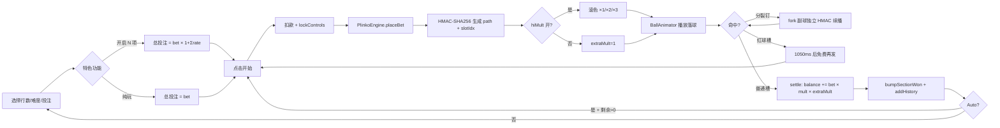
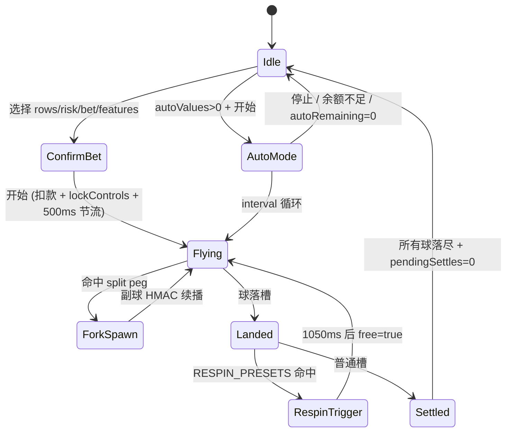

# 爆裂足球 7500× — 产品需求文档（PRD）

> 足球主题 Plinko + 裂变机制 H5 小游戏 · 基于 Stake Provably Fair 算法的服务端权威架构

---

## 1. 文档信息


| 字段          | 内容                                                    |
| ----------- | ----------------------------------------------------- |
| 产品名称        | **爆裂足球 7500×**（内部代号：`lucky-drop` / `minigame`）        |
| 文档版本        | PRD v3.0（基于代码仓库 **mockup v83ν** 逆向）                   |
| 文档日期        | 2026-04-28                                            |
| 上一版本        | PRD v2.0（v83y）                                        |
| 目标平台        | Mobile-first H5（iPhone 14/16 逻辑分辨率，dpr cap 至 2）       |
| 技术形态        | 单文件 HTML + CSS + Canvas + Web Crypto（≈ 7100 行 mockup） |
| 产品阶段        | UI/玩法/经济/移动端适配/连击 HUD/性能优化全部完成；服务端 API 未接入（前端按接入就绪架构） |
| 当前 git HEAD | `v83ν 改 v19：mega-bump 性能优化（去 filter + will-change）`   |
| 数学验证        | Bun + 自写 MC Solver 跑 2000 万次/模式，验证 RTP 96.5%          |


---

## 2. 产品概述

### 2.1 产品定位

面向**足球赛事流量**的 Casino-style 小游戏。把 Plinko 机制包装成"把足球从球门踢下，穿过场地钉子阵列，落入底部倍率槽"的观赛风味体验，并通过**裂变 / 免费球 / 高倍率球**三件套放大单局爆点上限。

- 蹭赛事情绪势能（世界杯 / 欧冠 / 联赛决赛）；
- 用体育化叙事与 IP 资产降低博彩机制的首次认知门槛；
- 三项 Feature Buy 叠加最大单球理论倍率 **7500×**（顶槽 2500× × 金球 ×3）。

### 2.2 目标用户画像


| 画像                   | 特征                        | 核心诉求                         |
| -------------------- | ------------------------- | ---------------------------- |
| **P1 · 体育游戏玩家**      | 赛事流量引入；不熟悉传统 Casino       | 简单易懂、视觉冲击、快速爆分反馈             |
| **P2 · 老 Plinko 玩家** | 熟悉 Stake Plinko、敏感 RTP/难度 | 公平性可验证、Auto 投注、高难度槽位         |
| **P3 · 中度氪金玩家**      | 追求"特色功能爆分"                | 想要可购买的高波动玩法（裂变 / 免费球 / 高倍率球） |


### 2.3 核心价值主张

> **"一脚踢出去，看你的球能把多少奖金带回来——金球可以让它再翻三倍。"**

- **简单**：一个开始按钮、一颗球、一条随机下落路径；
- **公平**：Stake 风格 Provably Fair（HMAC-SHA256 + serverSeedHash 提前公开）；
- **可控**：9 档行数 × 3 档难度 × 3 项可独立或组合开启的特色 = **81 种数学配置**；
- **有爆点**：16 行疯狂 + 金球 = **7500×**（押注 1000 时理论最高 750 万返还）。

### 2.4 竞品对标


| 维度          | Stake Plinko（标杆）  | 爆裂足球 7500×（本产品）                         |
| ----------- | ----------------- | --------------------------------------- |
| 最大倍率        | 1000× (16 行 High) | **7500×**（2500× 金球 ×3）                  |
| 基础顶槽        | 1000×             | **2500×**                               |
| RTP（基础）     | ≈ 99%             | **97.5%**                               |
| RTP（任一特色开启） | 无                 | **98%**                                 |
| 主题          | 抽象球 + 金属钉         | **足球 + 日光体育场 + 球门**                     |
| 特色机制        | 无                 | **三项独立可叠加 Feature Buy**（裂变 / 免费球 / 高倍率） |
| 可验证性        | HMAC-SHA256       | 同（完全对齐 Stake 算法）                        |


### 2.5 Logo 与品牌资产（v83w）

LOGO 为游戏化字标，三段式：

- **「爆裂足球」**：金色立体浮雕（深棕描边 + 三层金色厚度 + 蓝色投影）；
- **「7500」**：橙红渐变 + 厚红色立体边模拟火焰爆破质感；
- **「×」**：红色实心，体积小于数字以保持节奏。

字标整体以 SVG 文本 + CSS `text-shadow` 多层堆叠实现，无外部图片依赖，可在任意分辨率清晰渲染。

---

## 3. 核心玩法

### 3.1 玩法总览

玩家从顶部球门发一颗足球，球经过 **R 行钉子**（R ∈ [8, 16]，**默认 11**）的随机左右碰撞后落入底部 **R+1 个倍率槽**，按"投注额 × 倍率 × extraMult"结算。

- 路径与槽位由 HMAC-SHA256 预先算出，前端 Canvas 物理只负责可视化；
- 同屏球数上限 `MAX_BALLS = 16`（裂变 / Auto 模式时仍受此约束）；
- 默认投注 betValues[3] = **$10**，初始余额 **$10000**。

### 3.2 核心循环




### 3.3 单局时序

```
t=0ms     用户点击"开始"
          ├─ v83u 500ms 时间锁：拒绝 ghost click 与双击重入
          ├─ 扣除 totalCost = bet × (1 + Σfeature_rate)
          ├─ lockControls(true)
          └─ PlinkoEngine.placeBet({ rows, modeIdx })
             └─ HMAC-SHA256(serverSeed, `${clientSeed}:${nonce}:${cursor}`)
             └─ 返回 { path[R], slotIdx, multiplier, seed }

t≈50ms    球从 domeBase 喷出，initY=padT-30, initVy=1.8
          若 hiMult 开启：滚色生成 ×1/×2/×3（85/10/5）

t≈R×180ms 每行触发 pegHit（钉子三层光泛 + SFX）
          命中 SPLIT_PRESETS 钉子 → spawnForkBall
            （副球 HMAC：`...:fork:{r}:{c}:...`，独立路径）

t≈3s      球落入 slotIdx 对应槽，settle：
          ├─ winning 脉冲 + 冲击光
          ├─ bumpSectionWon(won) 浮沉胶囊
          ├─ balance += bet × mult × extraMult
          ├─ addHistory(multiplier)
          └─ 若 RESPIN_PRESETS 命中 → 1050ms 后 launchBall({ free:true })

t≈5.5s    所有球落尽 + 2.5s 无新球 → sectionWon 归零淡出
          lockControls(false)
```

---

## 4. 游戏机制详解

### 4.1 钉子阵列（三角形 Pascal 结构）

```
                   ●            ← 第 0 行：3 钉
                  ● ●           ← 第 1 行：4 钉
                 ● ● ●
                ● ● ● ●
              ...
        ╔══════════════════════╗ ← 底部 R+1 槽
        ║0.1║...║中心低倍║...║7500×║
        ╚══════════════════════╝
```

**几何参数**：


| 常量           | 值                                   | 含义                                        |
| ------------ | ----------------------------------- | ----------------------------------------- |
| `PAD_SIDE`   | 10 px                               | 画板左右安全边                                   |
| `W_LOGIC`    | **378**                             | 逻辑宽度（mobile 撑满 100vw 时 W>378，仍按 378 计算钉距） |
| `d(R)`       | `(W_LOGIC − 20) / (R + 1)`          | 钉距：行数越少钉距越大                               |
| `rowH`       | `d × √3/2`                          | 行高                                        |
| `pegR`       | `0.17 × min(rowH, d)`               | 钉子半径                                      |
| `WALL_SLOPE` | 0.19                                | 梯形球场侧墙斜率                                  |
| `pegX(r,c)`  | `cx − (r+2)·d/2 + c·d`              | 第 r 行第 c 列 X 坐标                           |
| `pegY(r)`    | `padT + r·rowH + rowH/2 + pegShift` | Y 坐标                                      |
| 每行钉数         | `r + 3`                             | 第 r 行（0-indexed）钉数                        |


**行数选择**：`ROWS ∈ [8, 16]`，默认 **11**（v82 由 13 改为 11）；对应底部 9~17 个倍率槽。

### 4.2 物理 / 动画参数

> 物理只做视觉，不决定结果。结果由 `PlinkoEngine.placeBet` 的 HMAC-SHA256 算出。


| 常量           | 值                          | 作用                      |
| ------------ | -------------------------- | ----------------------- |
| `BOUNCE_UP`  | 0.36                       | 撞钉后 vy' = −|vyEnd|×0.36 |
| `BOUNCE_TAN` | 0.92                       | 切向能量保留率                 |
| `initVy`     | 1.8                        | 入场初速度                   |
| `initVx`     | (Random−0.5) × 0.6         | 起手微扰 ±0.3               |
| `MAX_BALLS`  | **16**                     | 同屏球数上限（v78 由 8 上调）      |
| `jitterSeed` | `engineNonce ^ 0x5a5a5a5a` | 接触点伪随机种子（可复现）           |


### 4.3 倍率槽分布（完整 9 × 3 = 27 组）

`SLOT_REF`（每行按"边缘 → 中心"列出一半，另一半左右对称镜像）：


| R          | 佛系（Low）                                           | 激进（Mid）                                        | 疯狂（High）                                                  |
| ---------- | ------------------------------------------------- | ---------------------------------------------- | --------------------------------------------------------- |
| 8          | 4 / 2 / 1.1 / 0.9 / **0.5**                       | 15 / 3 / 1.4 / 0.6 / **0.2**                   | 30 / 4 / 1.1 / 0.4 / **0.1**                              |
| 9          | 5 / 2.6 / 1.6 / 1.2 / **0.5**                     | 20 / 5 / 2 / 0.9 / **0.3**                     | 46 / 8 / 2.4 / 0.4 / **0.1**                              |
| 10         | 7 / 3 / 1.9 / 1.1 / 0.7 / **0.5**                 | 30 / 6 / 2.5 / 1 / 0.5 / **0.3**               | 80 / 6 / 2.4 / 1 / 0.4 / **0.1**                          |
| **11**（默认） | **9 / 4 / 2 / 1.6 / 0.9 / 0.5**                   | **50 / 9 / 4 / 1.5 / 0.6 / 0.3**               | **110 / 15 / 4 / 1.7 / 0.4 / 0.1**                        |
| 12         | 12 / 5 / 2.4 / 1.5 / 1 / 0.7 / **0.5**            | 75 / 12 / 3.5 / 1.5 / 0.9 / 0.6 / **0.3**      | 160 / 16 / 5.1 / 1.8 / 0.8 / 0.4 / **0.1**                |
| 13         | 15 / 6 / 2.4 / 1.8 / 1.2 / 0.9 / **0.5**          | 90 / 25 / 6 / 2.5 / 1.1 / 0.6 / **0.3**        | 300 / 43 / 8 / 2.5 / 1.1 / 0.4 / **0.1**                  |
| 14         | 18 / 7 / 5 / 2.6 / 1.5 / 1 / 0.7 / **0.5**        | 120 / 30 / 6 / 3 / 1.5 / 1 / 0.6 / **0.3**     | 500 / 64 / 15 / 4 / 1.5 / 0.6 / 0.3 / **0.1**             |
| 15         | 20 / 8 / 4 / 2 / 1.5 / 1.2 / 1 / **0.5**          | 150 / 32 / 9 / 4 / 2.5 / 1.2 / 0.6 / **0.3**   | 1000 / 75 / 24 / 6 / 2.5 / 0.8 / 0.3 / **0.1**            |
| 16         | 25 / 10 / 5 / 2.5 / 1.5 / 1.2 / 1 / 0.7 / **0.5** | 250 / 40 / 8 / 3 / 2 / 1.5 / 1 / 0.5 / **0.3** | **2500** / 200 / 24 / 5 / 2.1 / 1.2 / 0.6 / 0.3 / **0.1** |


> 加粗 = 该档中心槽（最低倍）。疯狂模式中心槽 ≤ 0.1×，是波动性的直接来源。
> **默认 11 行佛系**：玩家首次见到的槽位是 `9 / 4 / 2 / 1.6 / 0.9 / 0.5 / 0.5 / 0.9 / 1.6 / 2 / 4 / 9`（12 槽，对称展开）。

**槽颜色分级**（`valToClass(v)`）：


| 等级          | 触发条件     | 视觉      |
| ----------- | -------- | ------- |
| `s-jackpot` | v ≥ 25   | 洋红紫     |
| `s-high`    | v ≥ 3    | 亮红      |
| `s-orange`  | v ≥ 1.5  | 琥珀橙     |
| `s-yellow`  | v ≥ 1.2  | 青黄      |
| `s-warm`    | v ≥ 1.05 | 标准 cyan |
| `s-neutral` | v ≥ 0.8  | 淡青      |
| `s-low`     | v < 0.8  | 粉蓝白     |


### 4.4 特色玩法（Feature Buy）

三项独立开关 + 一键全开按钮，倍率费率固定：


| Feature          | `BUY_RATES` | 触发条件                             | 玩法幻想         |
| ---------------- | ----------- | -------------------------------- | ------------ |
| **裂变足球**（split）  | **+0.6**    | 球碰预设分裂钉 → 父球继续 + 副球（独立 HMAC）一并向下 | "一脚开花，爆分双倍押" |
| **免费足球**（respin） | **+0.2**    | 落入红球槽 → 1050ms 后免费再发一球           | "击中球衣就能补射"   |
| **高倍率球**（hiMult） | **+0.2**    | 发球时滚色：85% 白×1 / 10% 蓝×2 / 5% 金×3 | "稀有金球一击千钧"   |


总投注 = `bet × (1 + Σ 开启项 BUY_RATES)`，三项全开时 = `bet × 2.0`。

#### 4.4.1 裂变足球（v77 固定钉位）

**SPLIT_PRESETS 重大变更（v77）**：钉位不再随难度变化，9 档行数对应 9 组**固定 3 颗钉**（用户手动指定，1-indexed）。每行各难度共享同一组钉位，RTP 偏差由各难度 slot payouts 自身设计承担。

```js
const SPLIT_PRESETS = {
  // [r, c]（0-indexed），原始 1-indexed 注释为 (x, y)
  8:  [[2,1],[4,5],[6,3]],   // (3,2)(5,6)(7,4)
  9:  [[2,1],[5,5],[7,3]],   // (3,2)(6,6)(8,4)
  10: [[3,1],[6,6],[7,2]],   // (4,2)(7,7)(8,3)
  11: [[2,1],[5,5],[8,3]],   // (3,2)(6,6)(9,4)  ← 默认行数
  12: [[3,1],[5,5],[7,4]],   // (4,2)(6,6)(8,5)
  13: [[4,3],[7,3],[10,8]],  // (5,4)(8,4)(11,9)
  14: [[3,2],[8,6],[11,4]],  // (4,3)(9,7)(12,5)
  15: [[4,3],[8,3],[12,8]],  // (5,4)(9,4)(13,9)
  16: [[5,3],[9,7],[13,5]],  // (6,4)(10,8)(14,6)
};
```

**数学守恒（设计意图）**：

```
E_single(r, c, mask) =
  若 r == R:          M[c−1]
  若 (r,c) ∈ S ∧ mask 未置位:  E(r+1,c,mask') + E(r+1,c+1,mask')
  否则:               0.5 × (E(r+1,c,mask) + E(r+1,c+1,mask))

RTP_split = E(0, 1, 0) / 1.6    ⟹ 目标 ≤ 98%
```

> 与 v45 的"全搜索 27 组 RTP ≤ 98%"不同，v77 优先固定钉位的视觉一致性，理论 RTP 偏差由 MC 复测得到。

#### 4.4.2 免费足球（Respin）

**红球槽预设** `RESPIN_PRESETS[R]`（1-based）：


| R          | 槽位                    | P_hit  | RTP_respin |
| ---------- | --------------------- | ------ | ---------- |
| 8          | [3, 7]                | 0.2188 | 0.9953     |
| 9          | [2, 3, 8, 9]          | 0.1953 | 0.9713     |
| 10         | [4, 8]                | 0.2051 | 0.9796     |
| **11**（默认） | **[3, 4, 9, 10]**     | 0.2012 | 0.9764     |
| 12         | [5, 9]                | 0.1938 | 0.9704     |
| 13         | [4, 5, 10, 11]        | 0.1995 | 0.9750     |
| 14         | [3, 4, 5, 11, 12, 13] | 0.2013 | 0.9765     |
| 15         | [4, 6, 11, 13]        | 0.2043 | 0.9789     |
| 16         | [7, 11]               | 0.2101 | 0.9836     |


**守恒公式**：

```
RTP_respin = E_base × (1 + P_hit) / (1 + c_respin)
其中 c_respin = 0.2，E_base ≈ 0.975
⟹ P_hit ≈ 0.2 时 RTP 稳定在 97%~98.4%
```

#### 4.4.3 高倍率球（HiMult）

开启时每次发球按概率滚色：

```
P(白球, ×1) = 0.85
P(蓝球, ×2) = 0.10
P(金球, ×3) = 0.05

E[extraMult] = 0.85 + 0.10×2 + 0.05×3 = 1.20
RTP_hiMult   = 1.20 × 0.98 / (1 + 0.20) = 98.00%（精确守恒）
```

**球门视觉同步**（v83b）：未开 hiMult 时球门内 9 颗纯白足球；开启后长出第 10 颗，染色为 **2 蓝 + 1 金 + 7 白**。HiMult 打开时，球门内每帧给球随机小扰动（"煮沸"感），暗示稀有球随时被踢出。

**单球理论顶倍**：16 行疯狂顶槽 2500× × 金球 ×3 = **7500×**（押注 1000 → 750 万返还）。

### 4.5 拳皇式连击 HITS HUD（v83λ → v83ν 新增）

**设计动机**：传统 Plinko 单球落地即结算，玩家感知不到"自己越来越猛"的累积爽感。借鉴格斗游戏的 HITS 连击 UI，在屏幕右上角实时累积**裂变 HITS**与**免费 HITS**两套计数器，将单球事件转化为可见的 session 连击体验。

**HUD 结构**（屏幕右上角，竖排两行）：

```
┌─────────────────┐
│  裂变 14 HITS   │  ← 橙色（tier-3）
│  免费 7 HITS    │  ← 紫色（tier-2）
└─────────────────┘
```

- 文案：`<span>裂变</span><span>N</span><span>HITS</span>`
- 字体：Russo One + Bebas Neue + Anton（混合栈，中文 fallback PingFang SC Heavy）
- N=1 时 HUD 不显示（避免初始 FREE HIT 一帧闪现）
- N≥2 触发 HUD 显示 + 飞字幕（从 canvas 击中点飞向 HUD）

**4 档稀有度递进**（裂变与免费同款配色，仅文案区分）：

| Tier | 触发 N | 配色 | 视觉特征 |
|------|--------|---------|---------|
| tier-1 | 2-3 | 蓝色（`#4488ff → #1c5596`） | 默认 box-shadow |
| tier-2 | 4-8 | 粉紫（`#c044ff → #6818c8`） | 紫色 glow |
| tier-3 | 9-14 | 橙红（`#ff8800 → #c41a1a`） | 橙色 glow |
| tier-4 | 15+ | 4 色火焰（亮金 → 金黄 → 橙 → 深红） | `fireGlow` 光晕脉冲 + `fireBgFlow` 背景流动 |

**bump 动画**（每次 hit 触发缩放反馈）：

| 触发条件 | 动画 | 时长 | 缩放 |
|---------|------|------|------|
| N≥2，非金色档 | `comboBump` | 320ms | 1 → 1.23 → 1 |
| N≥2，金色档非里程碑 | 无（保持火焰流动） | — | — |
| N=15 首次进金色 / N % 5 == 0（20/25/30…） | `comboMegaBump` | 500ms | 1 → 1.32 → 0.95 → 1.06 → 1（多帧平滑回弹） |

**性能注意事项**（v83ν v19 修复）：

- 早期 mega-bump 用 `filter: brightness/saturate` 触发整个图层 paint，移动端 Safari 卡顿严重
- v19 重构为纯 `transform` 动画，加 `will-change: transform` 提前提升合成层
- tier-4 的 `fireGlow + fireBgFlow` 与 mega-bump 通过专门的 `.combo-item.tier-4.mega-bump` 规则同时声明 3 个 animation，避免 shorthand 覆盖

**清零时机**：

- 一局所有球落尽 + 2.5s 无新球 → 计数器淡出归零
- 淡出顺序：先 remove `show` class（opacity 0），280ms 后再 remove tier-* class（避免淡出最后一帧颜色变蓝 bug）

**未来作为 Frenzy 触发器的伏笔**：当前 HUD 是纯视觉装饰，不影响结算。下一版本计划复用累积值作为 SOCCER FRENZY 大奖模式的触发条件（详见 §12.1）。

---

## 5. 数值系统

### 5.1 全局 RTP 策略


| 场景         | RTP   | 设计意图                          |
| ---------- | ----- | ----------------------------- |
| **纯玩**     | 97.5% | 校准器对 SLOT_REF 等比缩放至 97.5%     |
| **任一特色开启** | 98.0% | 给付费玩家"更好 RTP"的体感；方差升高净亏可能性仍存在 |
| **三项叠加**   | ≈ 98% | 三项数学独立守恒，互不破坏                 |


### 5.2 投注与经济参数


| 参数                   | 值                                                          |
| -------------------- | ---------------------------------------------------------- |
| 投注档位 `betValues`     | `[1, 2, 5, 10, 15, 20, 25, 50, 100, 200, 500, 1000]`（12 档） |
| 默认投注                 | `betValues[3] = 10`（v62）                                   |
| 初始余额 `balance`       | **10000**（v62 由 3000 上调）                                   |
| 自动投注档位 `autoValues`  | `[0, 10, 25, 50, 100, 250, 500, 750, 1000, ∞]`             |
| `MAX_BALLS`          | 16（同屏球数上限）                                                 |
| `MANUAL_COOLDOWN_MS` | 700 ms                                                     |
| `AUTO_INTERVAL_MS`   | ≈ 700 ms                                                   |
| **PLAY 按钮节流**        | **500 ms 时间锁**（v83u 抗 ghost click）                         |


### 5.3 期望值示例（11 行佛系，默认场景）


| 槽位倍率            | 路径概率（二项分布）                | 押注 10 返还 |
| --------------- | ------------------------- | -------- |
| 9× (slot 0/11)  | C(11,0)/2¹¹ × 2 = 9.77e-4 | 90       |
| 4× (slot 1/10)  | C(11,1)/2¹¹ × 2 = 0.0107  | 40       |
| 2× (slot 2/9)   | 0.0537                    | 20       |
| 1.6× (slot 3/8) | 0.1611                    | 16       |
| 0.9× (slot 4/7) | 0.2686                    | 9        |
| 0.5× (slot 5/6) | 0.2256                    | 5        |
| **加权 RTP**      | **— ≈ 97.5%**             | —        |


### 5.4 平衡性考量


| 风险点                 | 缓解策略                                   |
| ------------------- | -------------------------------------- |
| **方差过高劝退新手**        | 默认 **11 行 + 佛系**（顶槽仅 9×，中心 0.5×）       |
| **Jackpot 信任危机**    | `s-jackpot` 洋红紫 + 冲击光，强化"真能命中"         |
| **Feature RTP 被破解** | 三项数学独立守恒证明 ≤ 98%；运营永不净亏                |
| **Auto 模式财务崩坏**     | Auto 上限 1000 次；锁定控件期间无法切难度；500ms 节流防误触 |


---

## 6. 界面设计

### 6.1 主界面线框（mobile 全屏 / 桌面 390 设备框）

```
┌──────────────────────────── 100vw ────────────────────────────┐
│ [iPhone 状态栏 9:41 + 信号 / WiFi / 电池]   ← mobile 隐藏     │
├───────────────────────────────────────────────────────────────┤
│ 爆裂足球 7500×                                          [⚙]   │  ← 游戏化字标
├───────────────────────────────────────────────────────────────┤
│ [🕐] ⎯⎯⎯ 历史倍率徽章（左渐隐 mask） ⎯⎯⎯⎯⎯⎯⎯⎯⎯⎯⎯⎯⎯⎯⎯⎯⎯ │
├───────────────────────────────────────────────────────────────┤
│           ┏━━━━━━━┓                                            │
│           ┃ GOAL  ┃   球门内 9 颗白足球（开 hiMult → 10 颗：   │  ← machine-wrap
│           ┗━━━━━━━┛   2 蓝 + 1 金 + 7 白；持续轻微抖动）        │
├───────────────────── board canvas（撑满 100vw） ───────────────┤
│       ╱           ● ● ● ● (11 行 = 13 钉/底行)         ╲      │
│      ╱        ●  ◆  ●  ◆  ●  ◆ ← 3 颗固定金色分裂钉      ╲     │
│     ╱     ● ● ● ● ● ● ● ● ● ● ● ●                       ╲     │
├──── slots-wrap（378 居中）── 12 槽 ──────────────────────────┤
│║ 9│4│ 2│1.6│0.9│0.5│0.5│0.9│1.6│ 2 │ 4 │ 9 ║                  │
│              [获得 +12.50]              ← bumpSectionWon       │
├───────────────────────────────────────────────────────────────┤
│ ╔══════════════════════════════════════════╗                  │
│ ║ 特色功能 ★ ↻ 💎    │ 总投注 $10.0       ║  ← 金色描边        │
│ ╚══════════════════════════════════════════╝                  │
│ ┌─行数 11─┐                  ┌──投注 $10──┐                  │
│ │  ‹ 11 › │     ╔═════╗      │   ‹ 10 ›   │                  │
│ └────────┘      ║足球 ║      └────────────┘                  │
│ ┌─难度 佛系┐    ╚═════╝      ┌─自动投注 0─┐                  │
│ │  ‹佛系› │                  │   ‹  0  ›  │                  │
│ └────────┘                   └────────────┘                  │
├───────────────────────────────────────────────────────────────┤
│ 余额 $10,000.00（Chakra Petch 900 + 垂直居中）                 │
└───────────────────────────────────────────────────────────────┘
```

### 6.2 倍率槽（11 行佛系示例）

```
┌──┬──┬──┬───┬───┬───┬───┬───┬───┬──┬──┬──┐
│9×│4×│2×│1.6│0.9│0.5│0.5│0.9│1.6│2×│4×│9×│   ← 12 槽对称
│灯│灯│灯│ 灯│ 灯│ 灯│ 灯│ 灯│ 灯│灯│灯│灯│
└──┴──┴──┴───┴───┴───┴───┴───┴───┴──┴──┴──┘
            ↑↑                    ← respin 槽位 [3,4,9,10]（红球图标覆盖）
```

### 6.3 控制区（grid 5-slot）

- Row 1（横跨）：特色功能金色描边按钮 + 总投注显示；
- Row 2-3 col 2：开始/停止足球按钮；
- Row 2 col 1/3：行数 / 投注；
- Row 3 col 1/3：难度 / 自动投注；
- 锁控制：飞行中或自动模式 → 所有 ‹› 箭头 disabled，特色功能与一键全开按钮置灰 `pointer-events:none`。

**开始按钮状态**：

- 默认：`ballbutton.jpeg` 背景（停球图）；
- 自动中：`.stopping` 类 → `stop-circle.png` 背景（已自带 STOP 烫印，v83q 同步预加载）。

### 6.4 特色功能弹窗

三张卡片纵向排列（裂变 +0.6 / 免费 +0.2 / 高倍率 +0.2），每张右侧 toggle；底部"一键全开"开关。卡片配色与"特色功能"按钮金色家族保持一致，与蓝色家族控件区分。

### 6.5 设置抽屉

```
┌──────────────────────────────────┐
│         ─────                    │
│   设置                           │
├──────────────────────────────────┤
│  📖  游戏规则              ›    │  ← v83 新增
│  🕐  投注记录              ›    │
│  🎵  音乐             [ON●──]   │
│  🔊  音效             [ON●──]   │
├──────────────────────────────────┤
│  ↪   退出游戏              ›    │
└──────────────────────────────────┘
```

#### 游戏规则弹窗（v83 新增）

四步教学卡（width:320）：

1. 选择行数与难度；
2. 开始投注，球随机下落；
3. 命中倍率槽即结算；
4. 开启特色功能（裂变 / 免费 / 高倍率）放大爆点。

### 6.6 投注记录弹窗


| 时间    | 总投注   | 总倍率  | 盈亏     |
| ----- | ----- | ---- | ------ |
| 14:23 | 10.0  | 3.2× | +22.00 |
| 14:22 | 16.0  | 0.1× | −14.40 |
| 14:22 | **0** | 1.5× | +15.00 |


### 6.7 余额不足提示（v83）

任意操作触发后端"余额不足" → 顶部 toast 居中淡入 3s（"余额不足，请充值"）。Auto 模式下若余额不足，立即停止自动模式并解锁。

### 6.8 交互状态机




---

## 7. 移动端适配（v83 系列重点）

### 7.1 viewport 与缩放

```html
<meta name="viewport" content="width=device-width, initial-scale=1.0,
      maximum-scale=1.0, user-scalable=no, viewport-fit=cover">
```

- `maximum-scale=1.0, user-scalable=no` 关闭整页缩放，包括 iOS Safari 双击图片放大；
- `viewport-fit=cover` + `env(safe-area-inset-*)` 适配刘海与底部 home bar。

### 7.2 mobile 响应式断点

```css
@media (max-width: 480px) {
  .device { width: 100vw; height: auto; min-height: 100dvh; border:none; }
  .device > .status { display: none; }              /* 真机自带状态栏，隐藏模拟 */
  .machine-wrap, .board-wrap { width: 100%; }        /* canvas 撑满 100vw */
  .slots-wrap { width: 378px; align-self: center; }  /* 玩法核心 378 居中 */
}
```

**关键设计**：mobile 下 board canvas 撑满 `100vw`，但**钉子位置仍按 W_LOGIC=378 计算**——多余空间由 canvas 自己绘制天空（`outBg + blurBlobs`），与球场内顶天空完全一致；slots-wrap 仍 378 居中，::before/::after 梯形与 canvas 球场底 cx±185 严格匹配，消除 V 形错位与色差。

### 7.3 Canvas 性能优化（v83y）

```js
const _rawDpr = window.devicePixelRatio || 1;
const _isMobile = window.innerWidth <= 480;
const dpr = _isMobile
  ? Math.min(2, Math.max(1, _rawDpr))    // mobile cap 至 2
  : Math.max(2, _rawDpr);                // 桌面强制 2× 防钉子糊
```

- iPhone 16/Pro 等 dpr=3 机型 canvas 面积原本是 CSS 面积的 9 倍，多球 + 多行时每帧重绘 400+ 钉子 + 草坪光影成为瓶颈；
- v83y mobile cap dpr=2，canvas 面积减少 **56%**，视觉差异肉眼不可辨。

### 7.4 PLAY 按钮抗双击放大（v83u 终极方案）

iOS Safari 的"双击图片放大"判定 + click/touchend 派发顺序不确定 → 早期版本出现"首次按没生效，双击才行"的 bug。v83u 弃用所有依赖事件顺序的防御，改用纯时间锁：

```js
startBtn.addEventListener('touchend', e => {
  if (e.cancelable) e.preventDefault();   // 切断 iOS 双击放大判定
  startBtn.click();                        // 主动派发 click
}, { passive: false });
startBtn.addEventListener('dblclick', e => e.preventDefault());

let _lastClickAccepted = 0;
startBtn.addEventListener('click', async () => {
  const now = Date.now();
  if (now - _lastClickAccepted < 500) return;   // 500ms 节流
  _lastClickAccepted = now;
  // ... 启动 / 停止 autoMode
});
```

- 不依赖 isTrusted / flag / 时间窗顺序，纯时间锁；
- 桌面 mouse 不受影响（MANUAL_COOLDOWN_MS=700ms 已是天花板）。

---

## 8. 视觉 / 动效规范

### 8.1 色彩系统（CSS 变量）


| Token                                            | 值                                       | 用途              |
| ------------------------------------------------ | --------------------------------------- | --------------- |
| `--sky-top / --sky-mid / --sky-bot / --sky-deep` | `#2f7bc4 / #1c5596 / #0e3a72 / #072149` | 天空渐变            |
| `--pitch-light / --pitch-mid / --pitch-dark`     | `#5fb344 / #4fa138 / #408a2c`           | 草坪              |
| `--peg-body`                                     | `#d0e2b8`                               | 钉子主体            |
| `--ui-blue-top / mid / bot`                      | `#3d93d8 / #1f6aac / #0d4a88`           | UI 胶囊蓝          |
| `--accent-cyan`                                  | `#4dd0e1`                               | 倍率高亮            |
| `--text-gold`                                    | `#ffd54a`                               | 金色飘字 / 特色功能金色描边 |


### 8.2 字体层级


| 层级      | 字体                   | 用例                         |
| ------- | -------------------- | -------------------------- |
| Display | **Chakra Petch 900** | LOGO / **余额（垂直居中）** / 倍率飘字 |
| Body    | Chakra Petch 400/600 | 控件标签 / 描述                  |
| Mono    | Space Mono           | 状态栏 / 投注记录时间戳              |


金额显示统一加 **$ 符号**（v83 全局规范），千分位格式化。

### 8.3 关键动效清单


| 名称                 | 触发                   | 时长               |
| ------------------ | -------------------- | ---------------- |
| `bumpSectionWon`   | 每球落槽                 | ≈ 400 ms（spring） |
| peg hit 三层光        | 球过钉子                 | ≈ 200 ms         |
| 分裂钉金色绽放            | split 触发             | ≈ 400 ms         |
| Respin 触发金光        | respin 槽命中           | 锁定守卫 1050 ms     |
| `respinSpinHit`    | 红球槽命中                | 1 s              |
| `jerseyRespinText` | 红球槽命中                | 1.5 s            |
| SPLIT! 飘字          | 分裂钉触发                | ≈ 1 s            |
| Logo 入场（v83e）      | window.load + 两帧 RAF | 600 ms 渐显        |
| `comboBump`        | HUD HITS+1（非金色档）     | 320 ms（spring）   |
| `comboMegaBump`    | HUD N=15 / N % 5==0  | 500 ms（多帧回弹）     |
| `fireGlow`         | tier-4 金色档常驻         | 1.4s loop        |
| `fireBgFlow`       | tier-4 背景渐变流动        | 2.6s loop        |
| `flyHitFromCanvas` | split 击中点 → HUD 飞字幕  | ≈ 800 ms         |
| `flyHitFromSlot`   | respin 槽 → HUD 飞字幕   | ≈ 800 ms         |


### 8.4 音频钩子


| Trigger                           | 资源        | 备注                                     |
| --------------------------------- | --------- | -------------------------------------- |
| BGM                               | `bgm.mp3` | **volume 0.14**（v83c 由 0.35 下调，避让落槽音效） |
| peg hit / land / jackpot / respin | 待补        | 设置抽屉的"音效"开关统一控制                        |


---

## 9. 首屏与资源加载（v83e + v83r）

### 9.1 首屏渐显

```css
.device { opacity: 0; transition: opacity .6s ease-out; }
.device.ready { opacity: 1; }
```

```js
// 等 window.load + 两帧 RAF + stop-circle.png 预加载（最多 800ms）
await Promise.race([waitImage('stop-circle.png'), wait(800)]);
requestAnimationFrame(() => requestAnimationFrame(() => {
  device.classList.add('ready');
}));
```

避免 Safari 刷新时闪现"半成品"状态（钉子未画完 / 草坪噪点未生成）。

### 9.2 stop-circle.png 同步预加载（v83r）

```html
<link rel="preload" as="image" href="stop-circle.png">
```

防止首次按 PLAY 切换"停止"状态时按钮 background 短暂空白。

---

## 10. 公平性与安全（Provably Fair）

### 10.1 算法流程

```mermaid
flowchart TB
  subgraph 首次访问
    A1[localStorage 无状态] --> B1[生成 serverSeed 32B]
    B1 --> C1[生成 clientSeed 16B]
    C1 --> D1[serverSeedHash = SHA256 serverSeed]
    D1 --> E1[nonce = 0]
  end

  subgraph 每次下注
    G1[nonce++] --> G2["msg = clientSeed:nonce:cursor"]
    G2 --> G3[HMAC-SHA256 → 32B]
    G3 --> G4[每 4B → f ∈ 0,1]
    G4 --> G5[Math.floor f×2 → R 个 0/1]
    G5 --> G6[path = L/R 序列]
    G6 --> G7[slotIdx = Σpath]
  end

  subgraph 轮换
    H1[玩家触发 rotateSeeds] --> H2[公开旧 serverSeed]
    H2 --> H3[玩家校验历史] --> H4[新 serverSeed + nonce=0]
  end
```




### 10.2 关键不变量

- 结果 100% 由算法决定，客户端物理仅可视化；
- `serverSeedHash` 下注前公开，`serverSeed` 仅在轮换时揭示，不可事后篡改；
- 分裂副球独立 HMAC（`...:fork:{r}:{c}:...`），每个分叉点可审计；
- HiMult extraMult 单独 HMAC 通道（与 path 独立），不影响 path 校验性。

---

## 11. 技术架构

### 11.1 前端模块

```
DOM / CSS Layout
├─ .status / .header / .history-bar
├─ .machine-wrap (球门 + dome + ball-stack)
├─ .board-wrap > #board (canvas)
├─ .slots-wrap > .slots + .section-won
├─ .controls (grid 5-slot)
├─ .footer-balance
├─ .settings-drawer + .drawer-backdrop
├─ .buy-modal / .rules-modal / .history-modal
└─ .toast (余额不足等)

Engine (JS)
├─ PlinkoEngine          — Stake PF / HMAC-SHA256
├─ BallAnimator          — 分段抛物线驱动 + 分裂副球树
├─ drawBoard()           — Canvas 球场 + 钉阵 + 梯形墙 + 草坪噪点
├─ drawGrass()           — 6100 颗像素噪点离屏缓存（CSS 共享 dataURL）
├─ SPLIT_PRESETS / RESPIN_PRESETS / SLOT_REF
├─ settle / bumpSectionWon / addHistory
├─ launchBall({ free })
└─ 控件绑定 / lockControls / Auto 定时器 / 500ms 节流

Storage
├─ localStorage['plinko_pf_v1']  (seed state)
└─ betHistory[] (in-memory, 上限 BET_HISTORY_MAX)
```

### 11.2 性能策略

- **HiDPI 自适应**：桌面 ≥ 2×；mobile cap 至 2× (v83y)；
- **草皮噪点离屏缓存**：6100 颗一次生成，每帧 `drawImage(cache)`；同步 dataURL 注入 CSS `--grass-noise` 供 slots-wrap::after 共享；
- **球 sprite 双缓冲**：`ball1.jpg` 圆形裁切生成 256px offscreen；
- **MAX_BALLS=16 硬截断**：split 触发前后各检查一次防竞态。

---

## 12. 后续迭代方向

### 12.1 优先级


| 优先级    | 项目                                               | 价值              | 成本                                |
| ------ | ------------------------------------------------ | --------------- | --------------------------------- |
| **P0** | 服务端 `/api/bet` 接入                                | Mock → 生产       | 中（替换 PlinkoEngine.placeBet）       |
| **P0** | 首次引导教学（前 3 球强制 11 行佛系 + 高亮）                       | 新手留存            | 低                                 |
| **P1** | **SOCCER FRENZY 大奖模式**（HITS 累积 30 触发）             | **老虎机式爆点 + 留存** | **中（复用 HUD 计数 + RTP 重新分配）**       |
| **P1** | 赛事皮肤切换（世界杯 / 欧冠 / 球队）                            | 蹭赛事流量           | 中                                 |
| **P1** | 球员卡掉落                                            | 长期留存 hook       | 高                                 |
| **P2** | 赛季排行榜                                            | 社交循环            | 高                                 |
| **P2** | Turbo 模式（2×/3× 速度）                               | 老玩家效率           | 低                                 |

#### 12.1.1 SOCCER FRENZY 大奖模式（详细设计）

**触发条件**：单局累积 `counts.split + counts.free ≥ 30 HITS` → 进入狂热模式

**仪式**（约 1.5s）：屏幕暗化 + 黄金光柱扩散 + 飘屏 `SOCCER FRENZY ×8`，pitch 描边变金、peg 全部镀金、BGM 切换

**狂热期特权**（固定 8 球）：

- 不扣余额（"免费"核心体验）
- 全局 multiplier 从 ×1 起步，每球 +0.5（×1 → ×4.5）
- 每球至少触发 1 个 split peg（程序保证）
- 顶部 HUD：`FRENZY 5/8 · TOTAL ×12.4`

**RTP 重新分配方案**（不破坏总 96.5% 预算）：

| 模块 | 当前贡献 | Frenzy 上线后 |
|---|---|---|
| 高倍率足球 | +0.8% | **+0.5%** |
| 多次裂变 | +1.2% | **+1.0%** |
| Respin 循环 | +1.5% | **+1.0%** |
| **SOCCER FRENZY**（新增） | — | **+1.0%**（触发率约 1/200 spin） |
| 总 RTP | **96.5%** | **96.5%**（守恒） |

**复用资产**：
- HITS HUD 已部署，从"视觉装饰"升级为"机制扳机"，零额外 UI 开发
- tier-4 火焰皮肤可直接做 frenzy 期间专属背景
- mega-bump 动画可作为 frenzy 触发瞬间的庆祝动画

**near miss 设计**（拓展）：HITS 接近 30 时（27/28/29）阶梯式 HUD 视觉强化（描边升级 + 心跳音效频率递增），落空时显示"差 X HITS！"飞字幕，强化"差一点就触发"的赌徒心流。


### 12.2 待测试假设


| 假设                                 | 验证点                                |
| ---------------------------------- | ---------------------------------- |
| 默认 bet=10 + 余额 10000 → 平均可玩 1000 手 | 是否穿越 RTP 收敛点（≈ 300 局）              |
| 11 行 + 佛系作为新手默认                    | 首 30 球至少命中 1 次 ≥1.6× 的概率（理论 ≈ 99%） |
| 16 行疯狂顶槽 2500× 命中概率 1.526e-5       | 满足"可感知稀有"（每 65536 球 1 次）           |
| 三项 Feature 全开使用率                   | 预计 < 5%，超 20% 警惕方差风险               |


### 12.3 已识别技术债

- `betHistory` 仅内存，刷新丢失 → 接服务端历史；
- `nonce` 仅 localStorage，跨设备无法接续；
- 草皮噪点每次行数变化重算 → 可预生成 9 种 cache；
- 音效钩子未完全接线，仅 BGM 可控，peg/land/jackpot 资源待补。

---

## 13. 版本演进里程碑（v44 → v83y）


| 版本         | 关键改动                                                      |
| ---------- | --------------------------------------------------------- |
| **v44**    | 服务端权威重构：Stake HMAC + 路径动画层分离                              |
| **v45**    | 严格数学 SPLIT_PRESETS（27 组全搜索 RTP ≤ 98%）+ 文案改名               |
| **v62**    | 默认投注 5 → 10；初始余额 3000 → 10000                             |
| **v77**    | SPLIT_PRESETS 重大变更：钉位固定（9 行数 × 3 颗，不再随难度）                 |
| **v78**    | MAX_BALLS 8 → 16，提升裂变同屏可视性                                |
| **v82**    | 默认行数 13 → 11，降低新手方差                                       |
| **v83b**   | hiMult 球门内同步：9 颗白 → 10 颗（2 蓝 + 1 金 + 7 白）                 |
| **v83c**   | BGM 音量 0.35 → 0.14，让落槽音效突出                                |
| **v83e**   | 首屏渐显（device opacity 0 → 1，window.load + 两帧 RAF）           |
| **v83i/p** | mobile board / slots / device 三段背景颜色严格对齐，消除 V 形错位         |
| **v83j**   | mobile 撑满 100vw，但钉子仍按 W_LOGIC=378 计算保持尺寸                  |
| **v83m**   | viewport 加 `maximum-scale=1.0, user-scalable=no`          |
| **v83q**   | stop-circle.png 同步预加载，避免首次切换闪烁                            |
| **v83r**   | `<link rel=preload>` stop-circle.png 移到 head              |
| **v83t**   | 发现 iOS Safari click/touchend 派发顺序不确定 bug                  |
| **v83u**   | PLAY 按钮抗双击：纯 500ms 时间锁取代所有事件顺序防御                          |
| **v83w**   | Logo 终版：「爆裂足球 7500×」游戏化字标                                 |
| **v83y**   | mobile 性能：dpr cap 到 2（iPhone 16 dpr=3 → 2，canvas 面积 −56%） |
| **v83λ**   | 自动模式投注记录修复：pendingBalls 计数器机制                          |
| **v83μ**   | OpenAI Images API 主界面 UI 概念图生成（gpt-image-1，7 套素材）        |
| **v83ν 改 v1-v8** | 拳皇式连击 HITS HUD 初版：双计数器 + 4 档稀有度（蓝→紫→橙→金）           |
| **v83ν 改 v9-v11** | 字体升级：Russo One + Bebas Neue + Anton 混合栈，文案 `裂变 N HITS` |
| **v83ν 改 v12-v14** | 修复 0 HITS 闪现 / N=1 飞字幕一帧闪 / 淡出最后一帧颜色变蓝 三个 bug    |
| **v83ν 改 v15-v17** | tier-4 fireGlow + fireBgFlow 火焰动画；mega-bump 频率 N % 5 == 0 |
| **v83ν 改 v18** | 修复 mega-bump 与 tier-4 fireGlow 的 CSS animation shorthand 冲突 |
| **v83ν 改 v19** | mega-bump 性能优化：去 filter brightness、加 will-change，移动端不再卡顿 |
| **MC v3 Solver** | Bun + 自写蒙特卡洛 solver 跑 2000 万次/模式，验证 RTP 96.5%（不改 SPLIT_PRESETS） |


产品定位变更：**GOLDEN GOAL 2500×** → **爆裂足球 7500×**（顶倍率口径由 16 行疯狂底槽 2500× 升级为 2500× × 金球 ×3 = 7500× 单球理论上限）。

**v3.0 关键产品演进**：从"纯 Plinko 玩法"演进为"连击 HUD + 永动机心流"——通过 HITS 累积 HUD 把单球事件升级为 session 级体验，并铺设 SOCCER FRENZY 大奖模式触发器（v3.1 计划）。

---

## 附录 A · 关键代码地标（index.html，v83y）


| 模块                                             | 行号区间      |
| ---------------------------------------------- | --------- |
| viewport / preload                             | 5-11      |
| Logo CSS（v83w）                                 | 237-300   |
| `@media (max-width: 480px)`                    | 2502-2559 |
| 默认 selectedRows = 11                           | 2990      |
| `MAX_BALLS = 16`                               | 2993      |
| `SPLIT_PRESETS`（v77 固定钉位）                      | 3048-3060 |
| `drawBoard` + dpr cap                          | 3082-3120 |
| 球门内足球数同步（hiMult）                               | 3812-3830 |
| `SLOT_REF` 倍率表                                 | 4257-4285 |
| `RESPIN_PRESETS`                               | 4768-4778 |
| `betValues / autoValues / balance / rowValues` | 4913-4971 |
| HiMult RTP 注释（v20 数学）                          | 5983-5999 |
| BGM volume 0.14                                | 6238      |
| 游戏规则弹窗绑定                                       | 6367-6376 |
| `BUY_RATES`                                    | 6397      |
| PLAY 按钮 v83u 抗双击                               | 6100-6145 |


**外部脚本（`/tmp/`）**：

- `plinko_respin_design.py` — RESPIN 守恒验证
- `plinko_rtp.py` / `plinko_search.py` — SPLIT_PRESETS 全搜索（v45 时代历史脚本）
- `plinko_calibrate_v8.py` / `plinko_mc.py` — RTP 校准与蒙特卡洛

---

**（END · PRD v2.0）**